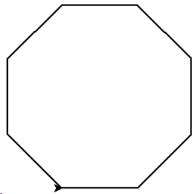
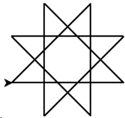

## turtle八边形绘制

### 图片示例：

<div align="center">

</div>

### 原始代码：

```python
#请在横线中填写Python表达式或语句，实现所需要的功能
#注意：补充代码将以匹配方式评阅，代码中不要出现空格

import turtle as t
t.pensize(2)
for i in range(______):
    t.fd(100)
    t.left(______)
```

答案：8；45

---

## turtle八角图形绘制

### 图片示例：

<div align="center">

</div>

### 原始代码：

```python
#请在横线中填写Python表达式或语句，实现所需要的功能
#注意：补充代码将以匹配方式评阅，代码中不要出现空格

import turtle as t
t.pensize(2)
for i in range(______):
    t.fd(150)
    t.left(______)
```

答案：8；135